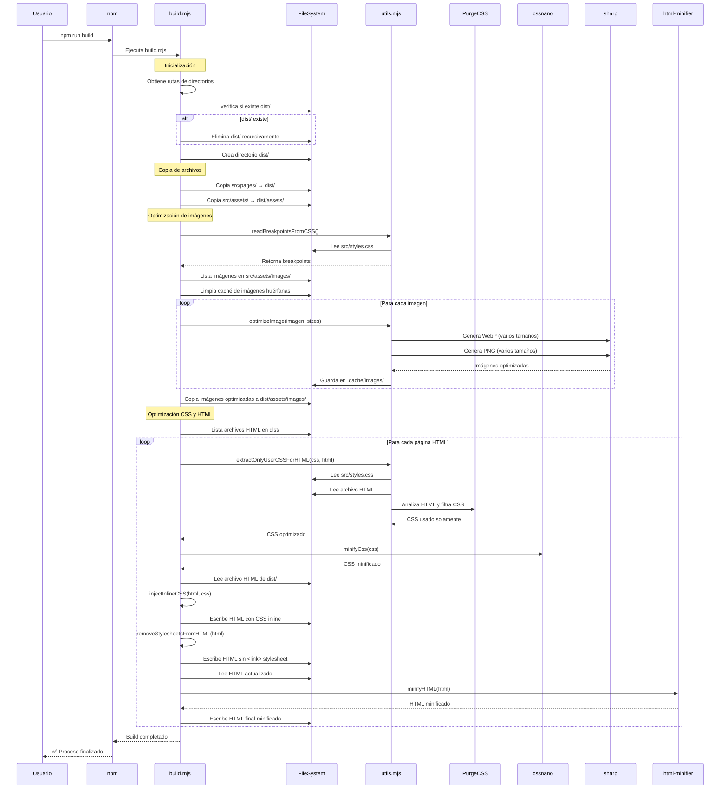

# Development Workflow

Esta guía describe el flujo de trabajo de desarrollo para el proyecto **vanilla-site**.

## 🚀 Quick Start

### Instalación

```bash
# Clonar el repositorio
git clone https://github.com/ivanlynch/vanilla-site.git
cd vanilla-site

# Instalar dependencias (si las hay)
npm install
```

### Comandos Disponibles

```bash
# Construir el sitio estático
npm run build

# Iniciar servidor de desarrollo
npm run dev
```

## 📂 Estructura de Trabajo

### Directorio `src/`

Aquí trabajas en el código fuente:

- `src/components/` - Componentes HTML reutilizables (header, footer)
- `src/pages/` - Contenido de páginas individuales
- `src/styles.css` - Estilos globales
- `src/index.html` - Template base para todas las páginas
- `src/assets/` - Recursos estáticos (fuentes, imágenes, favicon)

### Directorio `dist/`

**No editar manualmente**. Este directorio se genera automáticamente con `npm run build`.

## 🔨 Flujo de Desarrollo

### 1. Editar Componentes o Páginas

**Para modificar componentes comunes:**

```bash
# Editar header de todas las páginas
src/components/header.html

# Editar footer de todas las páginas
src/components/footer.html
```

**Para modificar contenido de páginas:**

```bash
# Editar página home
src/pages/home.html

# Editar página about
src/pages/about.html
```

### 2. Editar Estilos

Todos los estilos están en:

```bash
src/styles.css
```

El archivo usa **CSS Layers** para organización:

- `@layer reset` - Reset CSS
- `@layer base` - Variables y estilos base
- `@layer components` - Componentes específicos

### 3. Build del Sitio

Después de hacer cambios, ejecuta el build:

```bash
npm run build
```

Este comando realiza un proceso de optimización completo:

1. Limpia el directorio `dist/`
2. Copia páginas y assets a `dist/`
3. Optimiza imágenes generando versiones responsive en WebP y PNG
4. **Optimiza CSS** usando PurgeCSS para eliminar estilos no utilizados
5. **Inyecta CSS inline** en cada página HTML (eliminando archivos CSS externos)
6. **Minifica HTML** para reducir el tamaño de los archivos
7. **Minifica CSS** usando cssnano

#### Diagrama de Secuencia del Proceso de Build

El siguiente diagrama muestra el flujo detallado de ejecución cuando se ejecuta `npm run build`:



**Salida:**

```
dist/
├── index.html       # Home page (con CSS inline y minificado)
├── about.html       # About page (con CSS inline y minificado)
├── index.js         # JavaScript
└── assets/          # Assets copiados e imágenes optimizadas
```

**Nota importante:** El CSS ya no se genera como archivo separado. Cada página HTML contiene su CSS optimizado inline, lo que mejora el rendimiento al eliminar una petición HTTP adicional.

### 4. Preview Local

```bash
npm run dev
```

Esto inicia un servidor de desarrollo con las siguientes características:

- **Servidor HTTP** en **http://localhost:3000** sirviendo los archivos de `dist/`
- **File watching automático**: Observa cambios en `src/` y reconstruye automáticamente
- **Compression middleware**: Comprime las respuestas HTTP para mejor rendimiento
- **Build inicial**: Ejecuta un build automático al iniciar

**Flujo de trabajo mejorado:**

1. Ejecuta `npm run dev` una vez
2. Edita archivos en `src/`
3. El servidor detecta los cambios automáticamente
4. Reconstruye el proyecto y recarga en el navegador

**Nota:** El servidor usa `--watch` de Node.js para detectar cambios en los scripts, y un watcher personalizado para detectar cambios en `src/`.

## 📝 Crear una Nueva Página

### 1. Crear el archivo de contenido

```bash
src/pages/mi-nueva-pagina.html
```

```html
<section id="mi-nueva-pagina" class="page">
  <h1>Título de la Página</h1>
  <p>Contenido aquí...</p>
</section>
```

### 2. Ejecutar build

```bash
npm run build
```

El build script automáticamente:

- Detecta el nuevo archivo en `src/pages/`
- Genera `dist/mi-nueva-pagina.html` con header y footer incluidos

### 3. Actualizar navegación (opcional)

Si quieres agregar la página al menú de navegación:

```bash
src/components/header.html
```

```html
<nav>
  <ul>
    <li><a href="index.html">Home</a></li>
    <li><a href="about.html">About</a></li>
    <li><a href="mi-nueva-pagina.html">Mi Nueva Página</a></li>
  </ul>
</nav>
```

## 🎨 Modificar Estilos

### Variables CSS

Las variables globales están en `src/styles.css` dentro de `:root`:

```css
:root {
  --color-bg: #0a0a0a;
  --color-fg: #ededed;
  --text-xl: 1.25rem;
  --spacing-4: 1rem;
}
```

### Agregar Estilos de Componente

Agrega estilos dentro del `@layer components`:

```css
@layer components {
  .mi-componente {
    color: var(--color-accent-500);
    padding: var(--spacing-4);
  }
}
```

## 🧪 Testing & Preview

### Verificar Cambios

**Con file watching (recomendado):**

1. Ejecuta `npm run dev` (se construye automáticamente)
2. Haz tus cambios en `src/`
3. El servidor detecta cambios y reconstruye automáticamente
4. Recarga el navegador en http://localhost:3000
5. Verifica los cambios

**Sin file watching:**

1. Haz tus cambios en `src/`
2. Ejecuta `npm run build`
3. Ejecuta `npm run dev`
4. Abre http://localhost:3000
5. Verifica los cambios en el navegador

### Verificar HTML Generado

Revisa los archivos en `dist/` para asegurarte de que:

- Los componentes se inyectaron correctamente
- El CSS está inline (dentro de `<style>` tags)
- El HTML está minificado
- Las imágenes optimizadas están en `dist/assets/images/`

## 🔧 Tips & Troubleshooting

### El servidor dev no inicia (EADDRINUSE)

El puerto 3000 ya está ocupado. Termina el proceso anterior:

```bash
# Windows
netstat -ano | findstr :3000
taskkill /PID <process_id> /F

# O simplemente cierra la terminal anterior y abre una nueva
```

### Los cambios no se reflejan

**Con file watching:**

- El servidor debería detectar cambios automáticamente
- Si no detecta cambios, verifica que el archivo esté en `src/`
- Recarga el navegador después de que veas el mensaje "✅ Rebuild completed!"

**Sin file watching:**
Recuerda ejecutar `npm run build` antes de `npm run dev`:

```bash
npm run build && npm run dev
```

### Placeholders no se reemplazan

Verifica que el placeholder en `src/index.html` coincida con el nombre del archivo:

```html
<!-- Correcto -->
<!-- components/header -->
→ src/components/header.html
<!-- pages/home -->
→ src/pages/home.html

<!-- Incorrecto -->
<!-- header -->
→ No encontrará el archivo
```

## 🖼️ Image Optimization

El proyecto incluye un sistema automático de optimización de imágenes que genera versiones responsive en WebP y PNG.

### Cómo Agregar Imágenes

1. **Coloca la imagen original en** `src/assets/images/`:

```bash
src/assets/images/mi-foto.png
```

2. **Ejecuta el build:**

```bash
npm run build
```

3. **El sistema automáticamente genera** múltiples versiones optimizadas:

```
dist/assets/images/
├── mi-foto-480.webp    (Mobile)
├── mi-foto-480.png
├── mi-foto-600.webp    (Tablet)
├── mi-foto-600.png
├── mi-foto-800.webp    (Desktop)
├── mi-foto-800.png
├── mi-foto-1601.webp   (Retina/High-DPI)
└── mi-foto-1601.png
```

### Tamaños Generados

El optimizador de imágenes va a leer el archivo styles.css buscando los breakpoints CSS existentes (`--breakpoint-*`) y va a generar múltiples versiones optimizadas:

- **480px**: Para móviles (hasta 481px de ancho)
- **600px**: Para tablets (hasta 601px de ancho)
- **800px**: Para desktops
- **1601px**: Para pantallas retina/high-DPI

### Usando las imágenes optimizadas

Una vez que el build generó las imágenes optimizadas, úsalas en tu HTML:

```html
<picture>
  <source
    type="image/webp"
    srcset="
      assets/images/mi-foto-480.webp   480w,
      assets/images/mi-foto-600.webp   600w,
      assets/images/mi-foto-800.webp   800w,
      assets/images/mi-foto-1601.webp 1601w
    "
    sizes="(max-width: 481px) 480px, (max-width: 601px) 600px, 800px"
  />
  <source
    type="image/png"
    srcset="
      assets/images/mi-foto-480.png   480w,
      assets/images/mi-foto-600.png   600w,
      assets/images/mi-foto-800.png   800w,
      assets/images/mi-foto-1601.png 1601w
    "
    sizes="(max-width: 481px) 480px, (max-width: 601px) 600px, 800px"
  />
  
</picture>
```

### Beneficios

- **WebP**: 70-80% más pequeño que PNG
- **Responsive**: Solo descarga el tamaño necesario
- **Fallback automático**: PNG para navegadores que no soportan WebP
- **Optimización automática**: Calidad optimizada (WebP: 85%, PNG: 90%)

### Verificar Optimización

Después del build, verifica los ahorros en la consola:

```bash
npm run build

# Salida esperada:
🖼️  Processing: mi-foto.png (500.00 KB)
   ✓ 480px: WebP 16.49 KB | PNG 58.42 KB (WebP saves 72%)
   ✓ 600px: WebP 23.30 KB | PNG 87.19 KB (WebP saves 73%)
   ✓ 800px: WebP 32.76 KB | PNG 139.95 KB (WebP saves 77%)
   ✓ 1601px: WebP 87.54 KB | PNG 391.12 KB (WebP saves 78%)
   💾 Total saved with WebP: 517.96 KB
```

### Tips

- **Formato original**: Usa PNG o JPG de alta calidad
- **Tamaño original**: Al menos 1600px de ancho para mejor calidad en retina
- **Testing**: Usa DevTools → Network tab para verificar qué imagen se carga

## 🎯 Optimizaciones del Build

El proceso de build incluye varias optimizaciones automáticas:

### CSS Optimization (PurgeCSS)

- **Elimina CSS no utilizado**: Solo se incluye el CSS que realmente se usa en cada página
- **CSS inline**: El CSS se inyecta directamente en el `<head>` de cada HTML
- **Minificación**: El CSS se minifica usando cssnano
- **Resultado**: Archivos HTML más pequeños y menos peticiones HTTP

### HTML Minification

- **Colapsa espacios en blanco**: Reduce el tamaño del HTML
- **Elimina comentarios**: Los comentarios HTML se eliminan en producción
- **Optimiza atributos**: Elimina atributos redundantes y opcionales
- **Resultado**: Archivos HTML más pequeños y carga más rápida

### Image Optimization

Ver sección [🖼️ Image Optimization](#-image-optimization) más abajo.

## 📦 Deploy

Para hacer deploy del sitio:

1. Ejecuta el build de producción:

```bash
npm run build
```

El build genera archivos optimizados en `dist/`:

- HTML minificado con CSS inline
- Imágenes optimizadas en WebP y PNG
- JavaScript sin cambios (ya está optimizado)

2. Despliega el directorio `dist/` a tu hosting:
   - **Netlify**: Arrastra `dist/` o conecta el repo
   - **Vercel**: Conecta el repo, configura `dist/` como output
   - **GitHub Pages**: Usa GitHub Actions para copiar `dist/` a `gh-pages` branch

**Nota:** El servidor de desarrollo incluye compression middleware, pero en producción tu hosting debería manejar la compresión automáticamente.

## 🗂️ .gitignore

El proyecto ignora:

```
node_modules/
.idea/
dist/
**/*Zone.Identifier
```

**Importante:** `dist/` NO se sube al repositorio porque es generado automáticamente.

## 🔄 Git Workflow

```bash
# 1. Hacer cambios en src/
# 2. Build y test local
npm run build
npm run dev

# 3. Commit
git add src/
git commit -m "feat: descripción del cambio"

# 4. Push
git push origin main

# 5. El CI/CD automáticamente ejecutará npm run build y desplegará dist/
```
